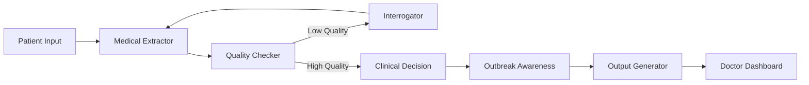

<div align="center">

# 🏥 GHIA - Gramin Health Intake Assistant

### AI-Powered Multi-Agent Healthcare System for Rural India

[](https://python.org)
[](https://fastapi.tiangolo.com)
[](https://langchain-ai.github.io/langgraph/)
[](https://groq.com)
[](LICENSE)

<p align="center">
  
  
</p>

---

**Bridging the healthcare gap in rural India through voice-powered AI**

[🚀 Quick Start](#-quick-start) •
[✨ Features](#-key-features) •
[🏗️ Architecture](#️-system-architecture) •
[📖 API Docs](#-api-endpoints) •
[🤝 Contributing](#-contributing)

</div>

---

## 🎯 The Problem We're Solving

<table>
<tr>
<td width="50%">

### 💔 Healthcare Challenges in Rural India

- **1 doctor per 10,000+ patients** in rural areas
- **Language barrier**: Patients speak Hindi/Hinglish, medical records need English
- **Limited time**: Doctors spend 2-3 minutes per patient
- **No digital records**: Paper-based systems lead to information loss
- **Delayed triage**: Critical cases often wait too long

</td>
<td width="50%">

### 💚 How GHIA Helps

- ✅ **Voice-first**: Patients speak naturally in Hindi/Hinglish
- ✅ **AI Triage**: Automatic urgency classification
- ✅ **Bilingual Output**: Hindi summaries for patients, English for doctors
- ✅ **Red Flag Detection**: Never miss critical symptoms
- ✅ **Outbreak Alerts**: Community health surveillance

</td>
</tr>
</table>

---

## ✨ Key Features

<table>
<tr>
<td align="center" width="25%">
<h3>🎙️</h3>
<h4>Voice-First Interface</h4>
<p>Patients speak naturally in Hindi, Hinglish, or English</p>
</td>
<td align="center" width="25%">
<h3>🤖</h3>
<h4>Multi-Agent AI</h4>
<p>6 specialized agents working together autonomously</p>
</td>
<td align="center" width="25%">
<h3>🚨</h3>
<h4>Smart Triage</h4>
<p>Automatic urgency classification with red flag detection</p>
</td>
<td align="center" width="25%">
<h3>🌐</h3>
<h4>Bilingual Reports</h4>
<p>Hindi for patients, English for medical records</p>
</td>
</tr>
<tr>
<td align="center" width="25%">
<h3>📊</h3>
<h4>Doctor Dashboard</h4>
<p>Real-time case management and analytics</p>
</td>
<td align="center" width="25%">
<h3>🔒</h3>
<h4>Privacy-First</h4>
<p>End-to-end encryption, local data storage</p>
</td>
<td align="center" width="25%">
<h3>🦠</h3>
<h4>Outbreak Detection</h4>
<p>Temporal-spatial analysis for disease clusters</p>
</td>
<td align="center" width="25%">
<h3>⚡</h3>
<h4>Real-Time</h4>
<p>LiveKit integration for live audio streaming</p>
</td>
</tr>
</table>

---

## 🏗️ System Architecture

```
┌─────────────────────────────────────────────────────────────────────────┐
│                     GHIA - Multi-Agent Architecture                     │
├─────────────────────────────────────────────────────────────────────────┤
│                                                                         │
│   📱 Patient Interface                                                  │
│   ┌─────────────┐     ┌─────────────┐     ┌─────────────┐              │
│   │   Voice     │     │   WebM      │     │   WebSocket │              │
│   │   Input     │────►│   Audio     │────►│   LiveKit   │              │
│   └─────────────┘     └─────────────┘     └──────┬──────┘              │
│                                                   │                     │
│   ─────────────────────────────────────────────────────────────────    │
│                                                   ▼                     │
│   🎤 ASR Layer          ┌─────────────────────────────────┐            │
│                         │   IndicWav2Vec / Whisper        │            │
│                         │   Hindi • Bengali • Tamil •     │            │
│                         │   Telugu • Marathi • Gujarati   │            │
│                         └──────────────┬──────────────────┘            │
│                                        │                                │
│   ─────────────────────────────────────────────────────────────────    │
│                                        ▼                                │
│   🧠 ORCHESTRATOR (LangGraph)                                          │
│   ┌────────────────────────────────────────────────────────────────┐   │
│   │                                                                 │   │
│   │  ┌──────────────┐   ┌──────────────┐   ┌──────────────┐       │   │
│   │  │   MEDICAL    │   │   QUALITY    │   │ INTERROGATOR │       │   │
│   │  │  EXTRACTOR   │──►│   CHECKER    │──►│    AGENT     │       │   │
│   │  │    AGENT     │   │    AGENT     │   │              │       │   │
│   │  └──────────────┘   └──────────────┘   └──────┬───────┘       │   │
│   │         │                                      │               │   │
│   │         │         ┌────────────────────────────┘               │   │
│   │         ▼         ▼                                            │   │
│   │  ┌──────────────────────┐   ┌──────────────┐                  │   │
│   │  │   CLINICAL DECISION  │   │   OUTBREAK   │                  │   │
│   │  │      SUPPORT         │──►│  AWARENESS   │                  │   │
│   │  │   (ICD-11 Coding)    │   │    AGENT     │                  │   │
│   │  └──────────────────────┘   └──────────────┘                  │   │
│   │                    │                                           │   │
│   │                    ▼                                           │   │
│   │         ┌──────────────────────┐                              │   │
│   │         │    OUTPUT AGENT      │                              │   │
│   │         │  (Bilingual Summary) │                              │   │
│   │         └──────────────────────┘                              │   │
│   │                                                                │   │
│   └────────────────────────────────────────────────────────────────┘   │
│                                        │                                │
│   ─────────────────────────────────────────────────────────────────    │
│                                        ▼                                │
│   💾 Data Layer                                                        │
│   ┌──────────────┐   ┌──────────────┐   ┌──────────────┐              │
│   │   SQLite     │   │  Encrypted   │   │    Audit     │              │
│   │   Database   │   │   Storage    │   │    Logs      │              │
│   └──────────────┘   └──────────────┘   └──────────────┘              │
│                                                                         │
│   ─────────────────────────────────────────────────────────────────    │
│                           ▼                          ▼                  │
│   📊 Interfaces                                                        │
│   ┌────────────────────────────┐   ┌────────────────────────────┐     │
│   │   🩺 Doctor Dashboard      │   │   📱 Patient Interface     │     │
│   │      (Streamlit)           │   │      (HTML/JS)             │     │
│   └────────────────────────────┘   └────────────────────────────┘     │
│                                                                         │
└─────────────────────────────────────────────────────────────────────────┘
```

---

## 🤖 Multi-Agent System

GHIA uses **LangGraph** for orchestrating 6 specialized AI agents:

| Agent | Icon | Role | Capabilities |
|-------|:----:|------|--------------|
| **Medical Extractor** | 🔍 | Extract symptoms & medical info | Hinglish understanding, duration parsing, severity assessment |
| **Quality Checker** | ✅ | Validate extracted data | Completeness check, confidence scoring, data quality |
| **Interrogator** | 💬 | Generate follow-up questions | Identifies missing information, conversational context |
| **Clinical Decision Support** | 🏥 | Medical analysis | ICD-11 coding, differential diagnosis, treatment suggestions |
| **Outbreak Awareness** | 🦠 | Community health monitoring | Temporal-spatial analysis, cluster detection, alerts |
| **Output Generator** | 📝 | Create bilingual summaries | Hindi + English reports, doctor-ready documentation |

### Agent Decision Flow



---

## 🚀 Quick Start

### Prerequisites

- Python 3.10+
- [Groq API Key](https://console.groq.com/) (Free!)
- FFmpeg (for audio processing)

### 1️⃣ Clone & Setup

```bash
# Clone the repository
git clone https://github.com/yourusername/MH_agents.git
cd MH_agents

# Create virtual environment
python -m venv .venv

# Activate (Windows)
.\.venv\Scripts\activate

# Activate (Linux/Mac)
source .venv/bin/activate

# Install dependencies
pip install -r requirements.txt
```

### 2️⃣ Configure Environment

```bash
# Copy example environment file
copy .env.example .env   # Windows
cp .env.example .env     # Linux/Mac

# Edit .env with your settings
```

**Required `.env` variables:**

```env
# LLM Configuration (Required)
GROQ_API_KEY=your_groq_api_key_here
LLM_MODEL=llama-3.1-70b-versatile

# Application Settings
APP_NAME=GHIA
ENVIRONMENT=development

# Optional: LiveKit for real-time audio
LIVEKIT_API_KEY=your_key
LIVEKIT_API_SECRET=your_secret
LIVEKIT_URL=wss://your-instance.livekit.cloud
```

### 3️⃣ Run the Application

```bash
# Terminal 1: Start Backend
uvicorn app.main:app --reload --host 0.0.0.0 --port 8000

# Terminal 2: Start Doctor Dashboard
streamlit run dashboard/app.py --server.port 8501

# Terminal 3: Serve Patient Frontend (optional)
python -m http.server 3000 --directory frontend
```

### 4️⃣ Access the Application

| Interface | URL | Description |
|-----------|-----|-------------|
| 🔌 API Docs | http://localhost:8000/docs | Interactive Swagger documentation |
| 🩺 Doctor Dashboard | http://localhost:8501 | Case management interface |
| 📱 Patient Interface | http://localhost:3000 | Voice input interface |
| ❤️ Health Check | http://localhost:8000/health | System status |

---

## 📖 API Endpoints

### Core Endpoints

| Method | Endpoint | Description |
|:------:|----------|-------------|
| `POST` | `/api/intake/audio` | Upload audio for transcription & analysis |
| `POST` | `/api/intake/text` | Submit text for analysis |
| `POST` | `/api/intake/process` | Full clinical decision support |
| `POST` | `/api/intake/demo` | Run demo with sample input |

### Dashboard Endpoints

| Method | Endpoint | Description |
|:------:|----------|-------------|
| `GET` | `/api/dashboard/intakes` | List all intake records |
| `GET` | `/api/dashboard/stats` | Summary statistics |
| `GET` | `/api/dashboard/alerts` | Active alerts & urgent cases |
| `GET` | `/api/dashboard/intakes/{id}` | Get specific intake details |

### Feedback & Analytics

| Method | Endpoint | Description |
|:------:|----------|-------------|
| `POST` | `/api/feedback/` | Submit doctor feedback |
| `GET` | `/api/feedback/performance` | AI accuracy metrics |

### Example: Submit Text Intake

```bash
curl -X POST "http://localhost:8000/api/intake/text" \
  -H "Content-Type: multipart/form-data" \
  -F "text=मुझे कमर में बहुत दर्द है तीन दिन से। बुखार भी है।" \
  -F "language=hi"
```

**Response:**

```json
{
  "id": 1,
  "session_id": "abc123",
  "risk_level": "moderate",
  "summary_english": "Patient presents with severe back pain for 3 days with fever. Moderate urgency.",
  "summary_hindi": "मरीज़ को 3 दिनों से कमर में तेज़ दर्द और बुखार है। मध्यम प्राथमिकता।",
  "symptoms": [
    {"symptom": "back pain", "severity": "severe", "duration": "3 days"},
    {"symptom": "fever", "severity": "moderate"}
  ],
  "recommended_action": "Examination within 24-48 hours. Consider NSAIDs for pain relief.",
  "follow_up_questions": ["Is the pain radiating to legs?", "Any difficulty urinating?"]
}
```

---

## 📁 Project Structure

```
MH_agents/
├── 📂 app/
│   ├── 📄 main.py                 # FastAPI entry point
│   ├── 📄 config.py               # Configuration & settings
│   ├── 📂 agents/
│   │   ├── 📄 orchestrator.py     # LangGraph multi-agent system
│   │   ├── 📄 clinical_decision.py # Clinical decision support
│   │   └── 📄 base_agent.py       # Agent base classes
│   ├── 📂 services/
│   │   ├── 📄 asr.py              # Speech recognition (IndicWav2Vec)
│   │   ├── 📄 llm.py              # LLM service (Groq)
│   │   ├── 📄 outbreak_detection.py # Outbreak surveillance
│   │   ├── 📄 livekit.py          # Real-time audio streaming
│   │   └── 📄 security.py         # Encryption & audit logging
│   ├── 📂 routes/
│   │   ├── 📄 intake.py           # Intake API routes
│   │   ├── 📄 dashboard.py        # Dashboard API routes
│   │   ├── 📄 feedback.py         # Feedback API routes
│   │   └── 📄 livekit.py          # LiveKit routes
│   ├── 📂 db/
│   │   ├── 📄 database.py         # SQLite database
│   │   └── 📄 repository.py       # Data access layer
│   └── 📂 schemas/
│       └── 📄 intake.py           # Pydantic models
├── 📂 dashboard/
│   └── 📄 app.py                  # Streamlit doctor dashboard
├── 📂 frontend/
│   └── 📄 index.html              # Patient voice input UI
├── 📄 requirements.txt
├── 📄 .env.example
├── 📄 .gitignore
└── 📄 README.md
```

---

## 🛠️ Tech Stack

<table>
<tr>
<td align="center" width="20%">

<br>Python 3.10+
</td>
<td align="center" width="20%">

<br>FastAPI
</td>
<td align="center" width="20%">

<br>SQLite
</td>
<td align="center" width="20%">

<br>Streamlit
</td>
<td align="center" width="20%">

<br>HTML/JS
</td>
</tr>
</table>

| Category | Technology |
|----------|------------|
| **Backend** | FastAPI + Uvicorn |
| **Multi-Agent** | LangGraph + LangChain |
| **LLM** | Groq (Llama 3.1 70B) - Free & Fast! |
| **ASR** | IndicWav2Vec / Faster-Whisper |
| **Database** | SQLite with encryption |
| **Dashboard** | Streamlit |
| **Real-time** | LiveKit WebRTC |
| **Frontend** | Vanilla HTML/CSS/JS |

---

## 🌐 Supported Languages

GHIA supports multiple Indian languages through IndicWav2Vec:

| Language | Code | Status |
|----------|:----:|:------:|
| Hindi | `hi` | ✅ Full Support |
| Bengali | `bn` | ✅ Supported |
| Gujarati | `gu` | ✅ Supported |
| Marathi | `mr` | ✅ Supported |
| Tamil | `ta` | ✅ Supported |
| Telugu | `te` | ✅ Supported |
| Nepali | `ne` | ✅ Supported |
| Odia | `or` | ✅ Supported |
| Sinhala | `si` | ✅ Supported |

---

## 📊 Demo

### Quick Demo

```bash
# Run demo with sample Hindi input
curl -X POST "http://localhost:8000/api/intake/demo"
```

### Sample Inputs to Try

```bash
# Back pain with fever
curl -X POST "http://localhost:8000/api/intake/text" \
  -F "text=मुझे कमर में बहुत दर्द है तीन दिन से। बुखार भी है।" \
  -F "language=hi"

# Chest pain (Urgent)
curl -X POST "http://localhost:8000/api/intake/text" \
  -F "text=सीने में दर्द हो रहा है और सांस लेने में तकलीफ है।" \
  -F "language=hi"

# Headache with vomiting
curl -X POST "http://localhost:8000/api/intake/text" \
  -F "text=सिर में बहुत दर्द है और उल्टी भी हो रही है।" \
  -F "language=hi"
```

---

## 🔒 Security & Privacy

| Feature | Implementation |
|---------|----------------|
| 🔐 Data Encryption | AES-256 encryption for sensitive data |
| 📝 Audit Logging | All access logged with timestamps |
| 🔑 Consent Management | Patient consent tracking |
| 🏠 Local Storage | All data stored locally (no cloud) |
| 🔒 HIPAA Considerations | Designed with healthcare privacy in mind |

---

## 🦠 Outbreak Detection

GHIA includes a community health surveillance system:

- **Temporal Analysis**: Detects unusual symptom spikes over time
- **Spatial Clustering**: Identifies geographic disease clusters
- **Alert System**: Notifies health authorities of potential outbreaks
- **Dashboard Integration**: Real-time alerts in doctor dashboard

---

## 🤝 Contributing

We welcome contributions! Here's how you can help:

1. 🍴 Fork the repository
2. 🌿 Create a feature branch (`git checkout -b feature/AmazingFeature`)
3. 💾 Commit your changes (`git commit -m 'Add AmazingFeature'`)
4. 📤 Push to the branch (`git push origin feature/AmazingFeature`)
5. 🔃 Open a Pull Request

### Development Setup

```bash
# Install development dependencies
pip install -r requirements-dev.txt

# Run tests
pytest

# Run linting
flake8 app/
black app/
```

---

## 📈 Roadmap

- [x] Multi-agent orchestration with LangGraph
- [x] Hindi/Hinglish ASR support
- [x] Bilingual summaries
- [x] Doctor dashboard
- [x] Outbreak detection
- [ ] ABDM (Ayushman Bharat) integration
- [ ] WhatsApp bot interface
- [ ] Offline mode for low-connectivity areas
- [ ] Mobile app (React Native)
- [ ] Voice response (TTS) for patients

---

## 📝 License

This project is licensed under the MIT License - see the [LICENSE](LICENSE) file for details.

---

## 👥 Team

<div align="center">

Built with ❤️ for **HealthTech Hackathon 2025**

*Empowering rural healthcare through AI*

---

<p>
<a href="https://github.com/yourusername/MH_agents">⭐ Star this repo</a> •
<a href="https://github.com/yourusername/MH_agents/issues">🐛 Report Bug</a> •
<a href="https://github.com/yourusername/MH_agents/issues">💡 Request Feature</a>
</p>

</div>